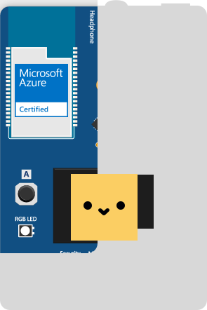
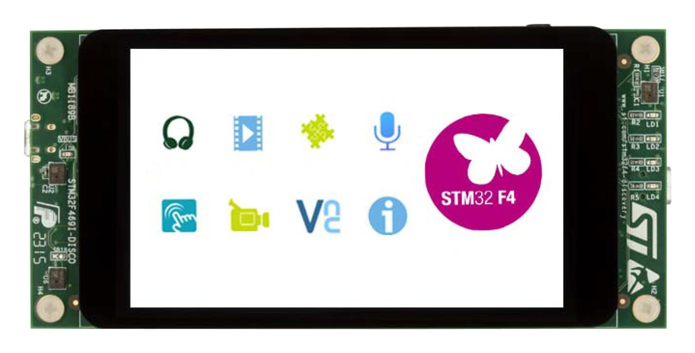
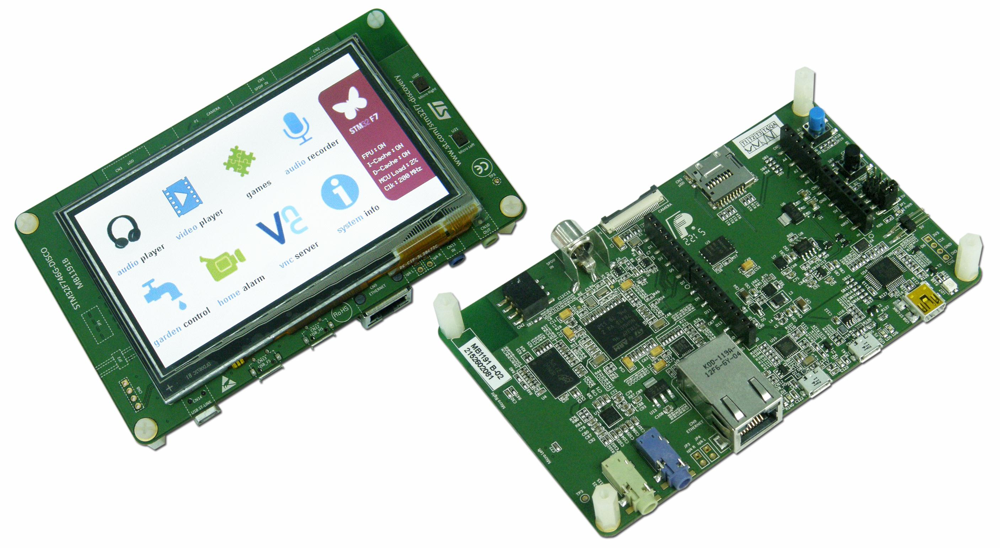
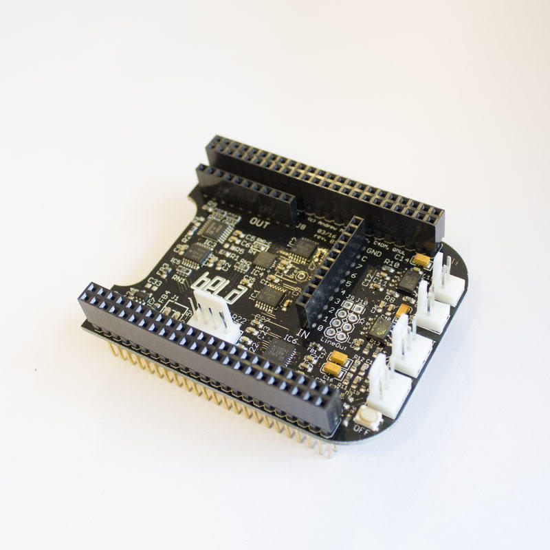

# Chirp Embedded Examples

A selection of examples using Chirp with embedded devices

## Setup

For all of the example apps you will need to

- Sign up at [developers.chirp.io](https://developers.chirp.io)
- Copy/paste your Chirp app key, secret and config string into the `credentials.h` file

----

## Microsoft MXChip

This example is now part of the examples shipped with the Chirp for Arduino library. Go to [Chirp for Arduino](https://developers.chirp.io/docs/getting-started/arduino) page to know more.

## STM32F469i Discovery

This example shows a simple demonstration of sending data with the Chirp SDK on the STM32F469i discovery board.

See the [README](stm32f469i-discovery/README.md) for further details.

## STM32F746g Discovery

This example shows a simple demonstration of sending and receiving data with the Chirp SDK on the STM32F746g discovery board.

See the [README](stm32f746g-discovery/README.md) for further details.

## Chirp + Bela

This example shows a simple demonstration of sending and receiving data with the Chirp SDK on Bela cape for BeagleBone Black board.

See the [README](bela/README.md) for further details.
