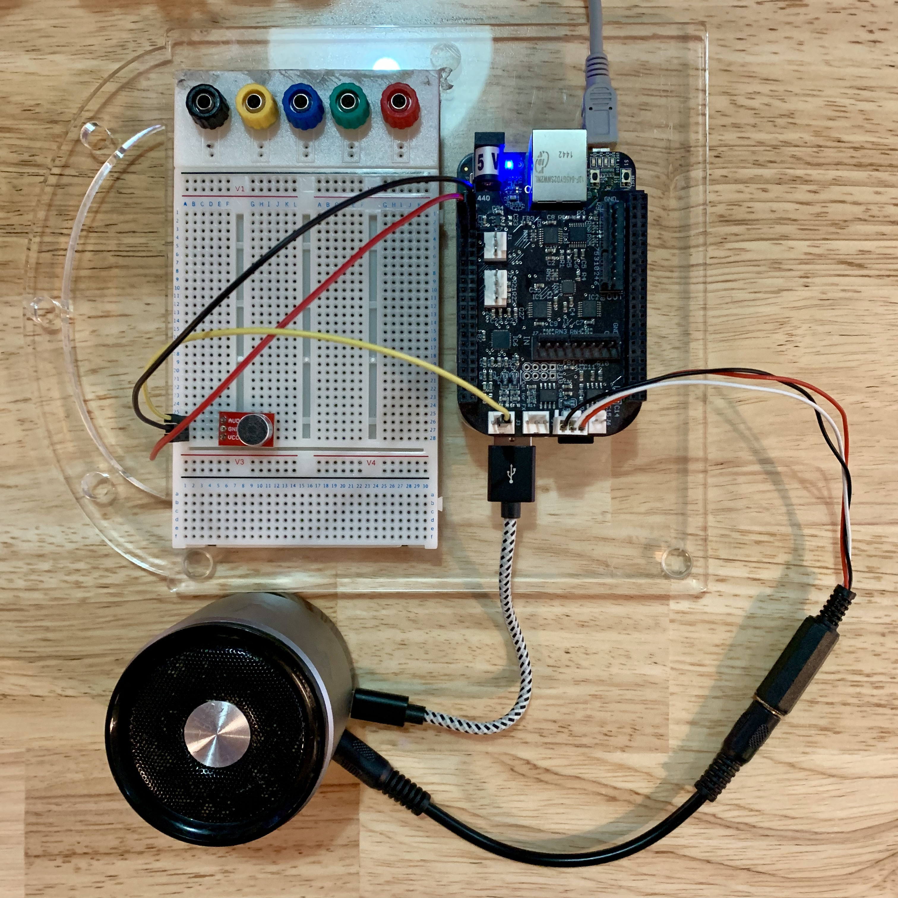

# Chirp + Bela

Use the high audio fidelity Bela cape for BeagleBone Black board to send and
receive data via sound with Chirp SDK !

## Prerequisites

- Follow the [Getting started with Bela](https://github.com/BelaPlatform/Bela/wiki/Getting-started-with-Bela) to get your board setup if it is not yet.
- Sign up to Chirp at the [Chirp developer hub](https://developers.chirp.io) to get your credentials.
- A microphone, the [Electret Microphone](https://www.sparkfun.com/products/12758) works well.
- A speaker.

## Setup

You can connect the microphone the following way : 
- GND --> P9_01
- VCC --> P9_03
- AUD --> LEFT IN - ADC1

Use the connector shipped with Bela to connect a speaker to the LEFT OUT connector.

See the image below for an example set up :



Copy/paste your Chirp app key, secret and config string into the `credentials.h` file.

## Building

Once the board is plugged to your computer, wait the time it boots and then go to
`http://192.168.7.2/` in your web browser. The Bela IDE should open.

On the right, click on the folder icon (Project Explorer) and then in `Manage projects` click on `New project`.

Select the type to be `C++` if it is not already selected and enter the name of your project and click on `Create`.

Always in `Project Explorer`, click on `Upload file`. Select `libchirp-connect_linux-arm-hard-shared.so` as well as the `chirp_connect*.h` headers located in the `chirp` folder, `credentials.h` and `render.cpp`. A warning window will tell you `render.cpp` already exist. Click on `Overwrite`. At this point the `Project Explorer` should only display the Chirp files, `credentials.h` and `render.cpp`.

Go to the `Project Settings`, select the `Block size` to 128 and the sample rate to 44100. Then, paste the following line in the `Make Parameters :` field replacing <name_of_your_project> by the name of your actual project :

```text
LDFLAGS=-L/root/Bela/projects/<name_of_your_project>;LDLIBS=-lchirp-connect_linux-arm-hard-shared;
```

Save, compile and run the project. The string "Hello World !" should start being sent as soon as the program starts and decoding at the same time.

The output in the console should be exactly the below one except the first line which will depend on the config and the version of the SDK being used :

```text
bela : Chirp Connect with "16khz-mono" config v2 [max 32 bytes in 4.48s], supporting 1 channel(s) - Version : 3.2.9
bela : State changed
bela : Sending data
bela : State changed
bela : Receiving data
bela : State changed
bela : Data sent
bela : State changed
bela : Data received : Hello World !
```
